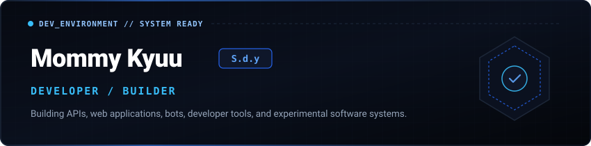
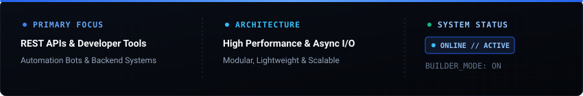

```yaml
identity:
  name: Mommy Kyuu
  alias: S.d.y
  role: Developer / Builder
  age: 17
  origin: Central Java, Indonesia
  aspiration: Senior Developer
  status: Active // Building & Experimenting
  focus:
    - High-Performance REST APIs
    - Automation Bots & Backend Services
    - Developer Tooling & Utilities
    - Experimental Software Systems
```



---


> **"Turning ideas into functional tools through pragmatic engineering and continuous experimentation."**

Mommy Kyuu (S.d.y) is a 17-year-old developer and builder based in Central Java, Indonesia, with a strong ambition to grow into a **Senior Developer**. Passionate about architecting clean backend systems, automation bots, and modern web software. Constantly exploring modern runtime environments, modular architectures, and pragmatic workflows.

- **Origin & Age:** 17 years old • Central Java, Indonesia
- **Career Goal:** Senior Developer / Backend Engineer
- **Core Focus:** Backend infrastructure, API design, bot automation, developer utilities.
- **Workflow:** Clean architecture, minimal dependencies, fast execution, lightweight footprint.

---


```
Backend & Systems  :: Go • Java • Kotlin • Node.js • PHP • Dart
Frontend & Script  :: TypeScript • JavaScript • CSS
Data & Tooling     :: SQL • Git
```


---


### 01 // Kyzz Apis


Platform API dan developer tools untuk integrasi backend, manipulasi data, dan penyediaan endpoint fungsional.

- **Category:** Public Developer Platform & API Suite
- **Deployment:** [api.kyzzz.xyz](https://api.kyzzz.xyz)

---

### 02 // Kyzz Temp


Layanan temporary file hosting dan file sharing cepat untuk penyimpanan serta distribusi berkas sementara.

- **Category:** Temporary File Storage & Distribution
- **Live Demo:** [tempfiles-ecru.vercel.app](https://tempfiles-ecru.vercel.app/)
- **Source Code:** [sfile.co/aFV577xkdHi](https://sfile.co/aFV577xkdHi)

---

### 03 // Kyzz Temp Mail


Modern disposable temporary email service yang dirancang untuk penerimaan email verifikasi dan inbox sementara secara instan.

- **Category:** Disposable Email Gateway & Inbox Receiver
- **Live Demo:** [tempfiles-ecru.vercel.app](https://tempfiles-ecru.vercel.app/)
- **Source Code:** [github.com/KyuuX444/kyzz-temp](https://github.com/KyuuX444/kyzz-temp)

---

### 04 // Base REST API


Base starter architecture dan fondasi modular untuk pengembangan REST API terstruktur dan siap pakai.

- **Category:** Backend Starter Template & REST API Foundation
- **Source Code:** [shorturl.at/Yo20G](https://shorturl.at/Yo20G)

---


[](https://instagram.com/kyzzapis)
[](https://tiktok.com/@mommyykyuu)
[](https://wa.me/kyuryn)
[](https://youtube.com/@momnykyuu)

- **Instagram:** [@kyzzapis](https://instagram.com/kyzzapis)
- **TikTok:** [@mommyykyuu](https://tiktok.com/@mommyykyuu)
- **WhatsApp:** [wa.me/kyuryn](https://wa.me/kyuryn)
- **YouTube:** [@momnykyuu](https://youtube.com/@momnykyuu)
